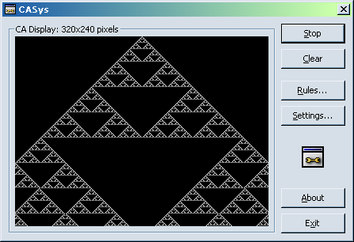

<div align="center">

## CASys 1\-D Cellular Automata System


</div>

### Description

CASys is a one-dimensional cellular automata system which supports general rulesets.
 
### More Info
 
This is much more interesting to people who understand 1D CAs. For an introduction to cellular automata, visit http://math.hws.edu/xJava/CA/index.html


<span>             |<span>
---                |---
**Submitted On**   |2002-05-18 17:19:18
**By**             |[Mark Christian](https://github.com/Planet-Source-Code/PSCIndex/blob/master/ByAuthor/mark-christian.md)
**Level**          |Advanced
**User Rating**    |5.0 (20 globes from 4 users)
**Compatibility**  |VB 6\.0
**Category**       |[Complete Applications](https://github.com/Planet-Source-Code/PSCIndex/blob/master/ByCategory/complete-applications__1-27.md)
**World**          |[Visual Basic](https://github.com/Planet-Source-Code/PSCIndex/blob/master/ByWorld/visual-basic.md)
**Archive File**   |[CASys846245182002\.zip](https://github.com/Planet-Source-Code/mark-christian-casys-1-d-cellular-automata-system__1-34915/archive/master.zip)

### API Declarations

```
BitBlt
GetPixel
SetPixel
StretchBlt
```


